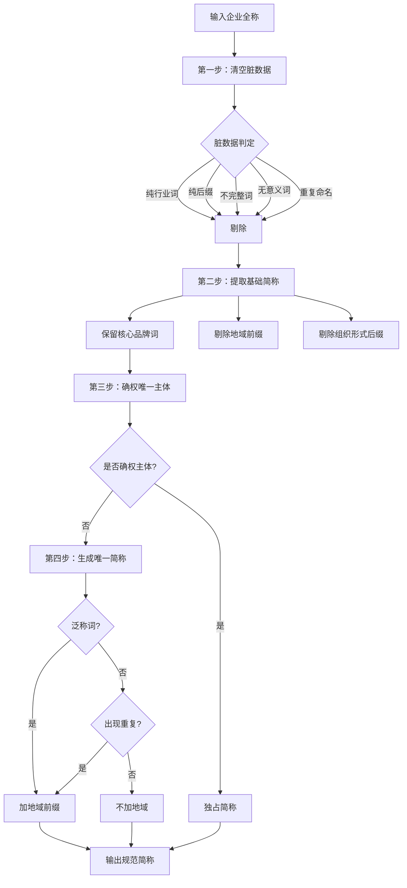

# Company Short Name

**企业简称智能清洗工具** - 将企业全称按照规则清洗为"唯一、规范、搜索友好"的简称，告别脏数据，统一企业命名标准。


---

## 📖 项目背景

在企业数据管理中，**企业简称的规范化**一直是一个痛点问题：

- 启信宝、天眼查等平台导出的企业名称存在大量**脏数据**
- 地域前缀混乱（省、市、区/县、乡镇）
- 组织形式后缀冗余（有限公司、工作室、个体工商户等）
- 同类企业简称不统一，无法精准检索

**本工具旨在解决以上问题**，提供一套可复用的企业简称清洗规则，支持批量处理，开箱即用。

---

## ✨ 核心优势

| 优势 | 说明 |
|------|------|
| 🚀 **智能提取** | 自动识别核心品牌词，精准提取行业关键词 |
| 🎯 **唯一性保证** | 重复名称自动加地域区分，确保每家企业唯一标识 |
| 📊 **规则可配置** | 支持自定义泛称词、后缀词、行业词库 |
| 🔧 **批量处理** | 支持 Excel 批量导入导出，高效处理海量数据 |
| 🌐 **多平台适配** | 适用于启信宝、天眼查等主流企业数据平台 |
| 📝 **少用地域** | 核心原则"能不出现地域就不出现地域"，简称更简洁 |

---

## 🔄 清洗流程



### 四步详解

#### 第一步：清空存量脏简称

剔除以下类型的脏数据：

| 类型 | 示例 | 判断标准 |
|------|------|----------|
| 纯行业词 | 文化科技、美容服务 | 仅体现行业，无主体标识 |
| 纯后缀 | 店、工作室、有限公司 | 仅体现组织形式 |
| 不完整词 | 小红、书科 | 核心词缺失 |
| 无意义词 | 仅含地域（梁溪、沙坪） | 无核心业务 |
| 重复命名 | 同名出现≥3家 | 无法精准命中 |

#### 第二步：提取基础简称

- ✅ **保留**：核心品牌词（如"小红书"、"抖音"）
- ❌ **剔除**：地域前缀（省、市、区/县、乡镇）
- ❌ **剔除**：后缀词（组织形式：店、工作室、有限公司等）
- ✅ **保留**：行业关键词

#### 第三步：确权唯一主体

指定唯一主体独占简称：

```
示例："小红书科技有限公司" → "小红书"
其他企业均不得使用纯"小红书"作为简称
```

#### 第四步：生成唯一简称

**核心原则**：地域前缀"能不出现就不出现"

| 场景 | 处理方式 | 示例 |
|------|----------|------|
| 具体行业词 | 不加地域 | 小红书物流、小红书物业管理 |
| 泛称行业词 | 加地域或加具体词 | 小红书科技 → 深圳小红书科技 |
| 出现重复 | 加地域区分 | 多个"小红书便利店" → 济南/杭州/广州小红书便利店 |

---

## 📊 效果对比

### 清洗前 vs 清洗后

> ⚠️ **问题**：原始数据中167家企业简称全部是"小红书"，完全无法区分！

**清洗前示例（原始脏数据）**：

| 原始简称 |
|----------|
| 小红书 |
| 小红书 |
| 小红书 |
| 小红书 |
| 小红书 |
| ... |

> 所有167家企业的原始简称都是"小红书"，完全无法区分！

### 使用本工具后

| 序号 | 企业全称 | 清洗后简称 |
|------|----------|------------|
| 1 | 小红书科技有限公司 | 小红书 |
| 2 | 济南小红书文化科技有限公司 | 济南小红书 |
| 3 | 郫都区小红书网红烫染馆 | 小红书网红烫染 |
| 4 | 深圳小红书科技有限公司 | 深圳小红书科技 |
| 5 | 成都郫都小红书摄影工作室 | 小红书摄影 |

### 核心改进

- ✅ **唯一性**：167家企业 → 167个唯一简称
- ✅ **规范性**：纯文本、无符号、搜索友好
- ✅ **简洁性**：能不出现地域就不出现地域
- ✅ **可追溯**：保留原始名称，便于核对

---

## 🛠️ 使用方法

### 适用工具

本 skill 适用于所有支持 Claude API 的编程工具：

- **Claude Code** - Anthropic 官方 CLI 工具
- **Claude.ai** - 网页版 Claude
- **支持 Claude API 的第三方应用** - 如各种集成 Claude 的开发工具

### 安装

1. 下载本仓库的 `.skill` 文件
2. 打开 Claude Code 设置 → Skills
3. 点击 **Install from file**
4. 选择下载的 `.skill` 文件

### 调用示例

安装后，直接用自然语言描述你的需求即可：

```
# 单条清洗
请帮我清洗企业简称：济南小红书文化科技有限公司

# 批量清洗
请帮我清洗以下企业简称：
- 济南小红书文化科技有限公司
- 深圳小红书科技有限公司
- 成都郫都小红书摄影工作室

# 从 Excel 批量处理
请帮我处理这个 Excel 文件中的企业简称，文件路径是 /path/to/companies.xlsx
```

### 输入格式

支持多种输入方式：

| 格式 | 示例 |
|------|------|
| 单条 | 济南小红书文化科技有限公司 |
| 多条（换行分隔） | 济南小红书文化科技有限公司<br>深圳小红书科技有限公司 |
| Excel 文件 | 提供 .xlsx 文件路径 |

### 输出格式

清洗结果将返回：

| 原始名称 | 清洗后简称 |
|----------|------------|
| 济南小红书文化科技有限公司 | 济南小红书 |
| 深圳小红书科技有限公司 | 深圳小红书科技 |
| ... | ... |

---

## 📂 文件结构

```
company-short-name/
├── company-name-cleaner.skill    # 🎯 Claude Code Skill 安装包
├── references/
│   ├── 后缀词库.md              # 📋 需剔除的后缀词库（90+后缀类型）
│   └── 行业词库.md             # 📋 需保留的行业词库（19大类）
├── README.md                     # 📖 项目介绍
└── LICENSE                      # 📜 MIT 许可证
```

---

## 📋 核心词库

### 泛称行业词（18个）

单独出现时需加地域前缀：

```
科技、实业、贸易/商贸/经贸、服务、管理、发展、投资、
集团、传媒、文化、商业、代理、咨询、策划、运营、供应链、企业、股份
```

### 后缀词示例（部分）

**组织形式**：`有限公司`、`工作室`、`商行`、`个体工商户`、`中心`、`店`、`馆`...

**行业后缀**：`科技有限公司`、`装饰工程有限公司`、`电子商务有限公司`...

详见：[后缀词库.md](./references/后缀词库.md)

---

## 🎯 适用场景

| 场景 | 说明 |
|------|------|
| 启信宝数据清洗 | 企业全称 → 规范简称 |
| 天眼查数据导入 | 批量处理企业名称 |
| 数据库标准化 | 建立统一的企业简称规范 |
| 数据分析 | 提升企业名称检索效率 |
| CRM系统集成 | 生成唯一企业标识 |

---

## 🔧 扩展定制

### 自定义泛称词

编辑 `references/行业词库.md` 中的"泛称词清单"部分。

### 自定义后缀词

编辑 `references/后缀词库.md`，添加新的后缀类型。

### 添加新的品牌词

修改清洗规则中的"核心品牌词"列表（如添加"抖音"、"淘宝"等）。

---

## 📝 示例展示

### 示例 1：具体行业词 → 不加地域

```
输入：成都郫都小红书摄影工作室
输出：小红书摄影
理由："摄影"是具体行业词，不加地域
```

### 示例 2：泛称行业词 → 加地域

```
输入：深圳小红书科技有限公司
输出：深圳小红书科技
理由："科技"是泛称词，需加地域区分
```

### 示例 3：重复场景 → 加地域区分

```
输入：
- 济南市小红书便利店
- 杭州市小红书便利店
- 广州市小红书便利店

输出：
- 济南小红书便利店
- 杭州小红书便利店
- 广州小红书便利店

理由：出现重复，加地域区分确保唯一性
```

### 示例 4：确权主体 → 独占简称

```
输入：小红书科技有限公司
输出：小红书
理由：确权主体，独占"小红书"简称
```

---

## 🤝 贡献

欢迎提交 Issue 和 Pull Request！

1. Fork 本仓库
2. 创建分支 (`git checkout -b feature/AmazingFeature`)
3. 提交更改 (`git commit -m 'Add some AmazingFeature'`)
4. 推送到分支 (`git push origin feature/AmazingFeature`)
5. 创建 Pull Request

---

## 📜 License

本项目采用 MIT License - 详见 [LICENSE](LICENSE) 文件

---

## 👤 作者

- GitHub: [ayulu01-crypto](https://github.com/ayulu01-crypto)

---

## 🙏 致谢

- 行业词库参考国家工商总局企业名称分类标准
- 后缀词库覆盖个体工商户全量组织形式

---

**如果这个工具对你有帮助，请给我们一个 ⭐Star！**
