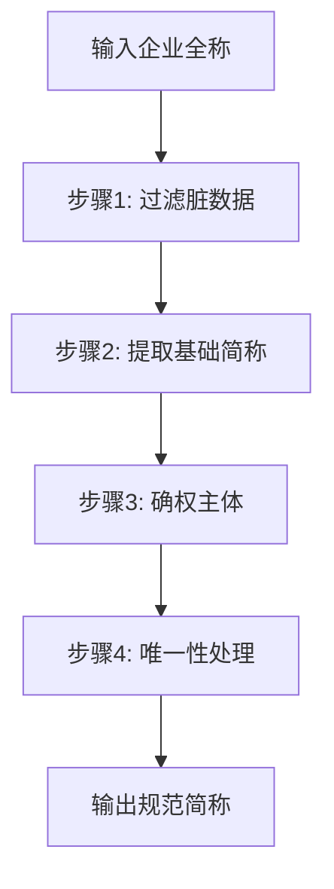

# Company Short Name

**企业简称智能清洗工具** - 将企业全称规范化为"唯一、准确、搜索友好"的简称


---

## 💡 核心价值

**一句话：让 167 家都叫"小红书"的企业，变成 167 个可区分的唯一简称**

企业数据管理的核心痛点：
- ❌ 地域前缀混乱（省、市、区、县、乡镇）
- ❌ 组织形式冗余（有限公司、工作室、个体工商户）
- ❌ 简称重复无法检索（上百家企业简称完全相同）
- ❌ 脏数据泛滥（纯行业词、纯后缀、无意义词）

**本工具提供：**
- ✅ 智能识别核心品牌词，保留关键行业特征
- ✅ 自动去重并加地域区分，确保简称唯一性
- ✅ 支持批量处理，适配启信宝、天眼查等平台
- ✅ 遵循"能不用地域就不用"原则，简称更简洁

---

## 🔄 清洗流程



### 四步清洗规则

**步骤 1：过滤脏数据**

剔除无效简称：纯行业词（"文化科技"）、纯后缀（"有限公司"）、不完整词（"小红"）、纯地域词（"梁溪"）、高频重复词（≥3家同名）

**步骤 2：提取基础简称**

保留核心品牌词和行业关键词，剔除地域前缀（省/市/区/县/乡镇）和组织形式后缀（店/工作室/有限公司等）

**步骤 3：确权主体**

为特定主体独占简称（如"小红书科技有限公司"独占"小红书"，其他同名企业不得使用纯"小红书"）

**步骤 4：唯一性处理**

遵循"最少地域原则"：
- 具体行业词（物流/物业/摄影）→ 不加地域
- 泛称行业词（科技/服务/贸易）→ 加地域
- 出现重复 → 加地域区分

---

## 📊 效果对比

### 清洗前：167 家企业简称全是"小红书"

| 企业全称 | 原始简称 |
|----------|----------|
| 小红书科技有限公司 | 小红书 |
| 济南小红书文化科技有限公司 | 小红书 |
| 郫都区小红书网红烫染馆 | 小红书 |
| 深圳小红书科技有限公司 | 小红书 |
| 成都郫都小红书摄影工作室 | 小红书 |
| ...（共167家） | 小红书 |

⚠️ **问题：完全无法区分！**

### 清洗后：167 个唯一简称

| 企业全称 | 清洗后简称 | 清洗逻辑 |
|----------|------------|----------|
| 小红书科技有限公司 | **小红书** | 确权主体，独占简称 |
| 济南小红书文化科技有限公司 | **济南小红书** | 泛称词"科技"，加地域 |
| 郫都区小红书网红烫染馆 | **小红书网红烫染** | 具体词"网红烫染"，不加地域 |
| 深圳小红书科技有限公司 | **深圳小红书科技** | 泛称词"科技"，加地域 |
| 成都郫都小红书摄影工作室 | **小红书摄影** | 具体词"摄影"，不加地域 |

✅ **实现：唯一、规范、简洁、可检索**

---

## 🛠️ 快速开始

### 安装方式

**方式一：Claude Code（推荐）**

```bash
# 在 Claude Code 中直接安装
/skill company-short-name
```

**方式二：手动安装**

1. 下载 `company-short-name.skill` 文件
2. Claude Code 设置 → Skills → Install from file

### 使用示例

直接用自然语言提出需求：

```
# 单条清洗
清洗企业简称：济南小红书文化科技有限公司

# 批量清洗
清洗以下企业简称：
- 济南小红书文化科技有限公司
- 深圳小红书科技有限公司
- 成都郫都小红书摄影工作室

# Excel 批量处理
处理 Excel 文件中的企业简称：/path/to/companies.xlsx
```

### 支持平台

- Claude Code（官方 CLI）
- Claude.ai（网页版）
- 任何支持 Claude API 的第三方应用

---

## 📂 项目结构

```
company-short-name/
├── company-short-name.skill    # Claude Code Skill 文件
├── references/
│   ├── 行业词库.md              # 19 大类行业词 + 泛称词清单
│   └── 后缀词库.md              # 10 大类后缀词（90+ 种）
├── README.md
└── LICENSE
```

---

## 📋 核心词库

### 泛称词（18个）

单独出现需加地域：科技、实业、贸易、服务、管理、发展、投资、集团、传媒、文化、商业、代理、咨询、策划、运营、供应链、企业、股份

### 行业词（19大类）

农林牧渔、采矿业、生产制造、电力热力、建筑工程、批发零售、交通运输、住宿餐饮、信息技术、金融业、房地产、租赁商务、科研技术、水利环境、居民服务、教育、卫生社工、文化体育、综合通用

详见：[行业词库.md](./references/行业词库.md)

### 后缀词（10大类，90+ 类型）

公司类、合伙企业、个人独资、个体工商户、分支机构、农民合作社、非公司法人、专业服务、通用后缀、方位词

详见：[后缀词库.md](./references/后缀词库.md)

---

## 💼 典型场景

| 场景 | 应用 |
|------|------|
| 启信宝/天眼查数据清洗 | 批量规范化企业简称 |
| 企业数据库标准化 | 建立统一命名规范 |
| CRM 系统集成 | 生成唯一企业标识 |
| 数据分析与检索 | 提升搜索准确率 |

---

## 📝 清洗示例

| 场景 | 输入 | 输出 | 规则 |
|------|------|------|------|
| 确权主体 | 小红书科技有限公司 | **小红书** | 确权主体独占简称 |
| 泛称词 | 深圳小红书科技有限公司 | **深圳小红书科技** | "科技"是泛称，加地域 |
| 具体词 | 成都郫都小红书摄影工作室 | **小红书摄影** | "摄影"是具体词，不加地域 |
| 去重 | 济南/杭州/广州小红书便利店 | **济南/杭州/广州小红书便利店** | 重复简称加地域区分 |

---

## 🔧 自定义扩展

需要定制词库？编辑以下文件：

- **泛称词**：`references/行业词库.md`
- **后缀词**：`references/后缀词库.md`
- **确权主体**：在 skill 文件中配置品牌词列表

---

## 🤝 参与贡献

欢迎提交 Issue 和 Pull Request 改进词库和规则

```bash
git checkout -b feature/your-feature
git commit -m 'Add some feature'
git push origin feature/your-feature
```

---

## 📜 开源协议

MIT License - 详见 [LICENSE](LICENSE)

---

## 👤 作者

GitHub: [ayulu01-crypto](https://github.com/ayulu01-crypto)

---

## 🙏 致谢

- 行业词库参考国家市场监督管理总局企业名称分类标准
- 后缀词库覆盖全量企业组织形式

---

⭐ **如果这个工具对你有帮助，请点个 Star！**
